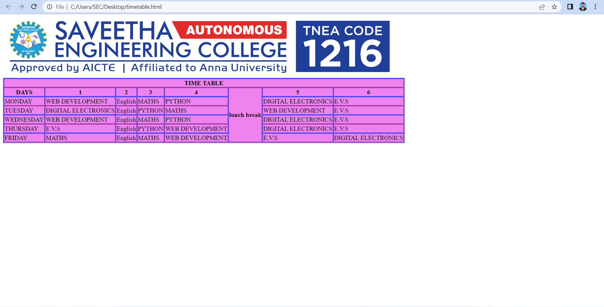

# Experiment_Time_Table

## AIM
To Write a html webpage page to display your timetable.

# ALGORITHM
### STEP 1
create a simple table using table tag
### STEP 2
Add header row using th tag
### STEP 3
Add your timetable
### STEP 4
Execute the program

# CODE
<!DOCTYPE html>
<html>

   <head>
      <title>TIME TABLE</title>
   </head>
	
   <body>
     
     <table border = "1" cellspacing="1" bordercolor="blue" bgcolor="violet">
         <tr>
            <th colspan="8">TIME TABLE</th>
         </tr>
         
         <tr>

            <th>DAYS</th>
            <th>1</th>
            <th>2</th>
            <th>3</th>
             <th>4</th>
            <th rowspan="6">lunch break</th>
            <th>5</th>
            <th>6</th>
         </tr>
          <tr>
             <td>MONDAY</td>
             <td>WEB DEVELOPMENT</td>
             <td>English</td>
             <td>MATHS</td>
             <td>PYTHON</td>
             <td>DIGITAL ELECTRONICS </td>
             <td>E.V.S</td>
             
    
         </tr>
         <tr>
            <td>TUESDAY</td>
            <td>DIGITAL ELECTRONICS</td>
            <td>English</td>
            <td>PYTHON</td>
            <td>MATHS</td>
            <td>WEB DEVELOPMENT </td>
            <td>E.V.S</td>
            
   
        </tr>
        <tr>
            <td>WEDNESDAY</td>
            <td>WEB DEVELOPMENT</td>
            <td>English</td>
            <td>MATHS</td>
            <td>PYTHON</td>
            <td>DIGITAL ELECTRONICS </td>
            <td>E.V.S</td>
            
   
        </tr>
        <tr>
            <td>THURSDAY</td>
            <td>E.V.S</td>
            <td>English</td>
            <td>PYTHON</td>
            <td>WEB DEVELOPMENT</td>
            <td>DIGITAL ELECTRONICS </td>
            <td>E.V.S</td.>
            
   
        </tr>
        <tr>
            <td>FRIDAY</td>
            <td>MATHS</td>
            <td>English</td>
            <td>MATHS</td>
            <td>WEB DEVELOPMENT</td>
            <td>E.V.S </td>
            <td>DIGITAL ELECTRONICS</td>
            
   
        </tr>
  
         
      </table>
      
   </body>
</html>

# OUPUT

 # RESULT
  The program is exceuted succesfully

